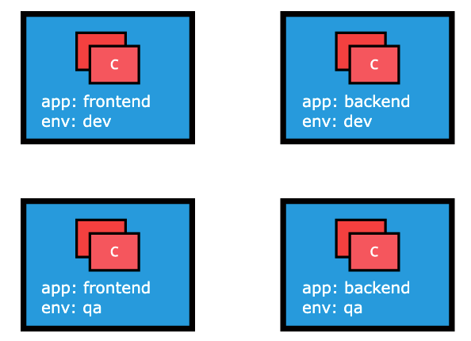

# Labels and Selectors

Labels are key-value pairs attached to Kubernetes objects such as Pods, ReplicaSets, Nodes, Namespaces and Persistent Volumes. Labels are used to organize and select a subset of objects, based on the requirements in place. Many objects can have the same Label(s). Labels do not provide uniqueness to objects. Controllers use Labels to logically group together decoupled objects, rather than using objects' names or IDs.

### Controllers, or operators, and Services, use label selectors to select a subset of objects. 