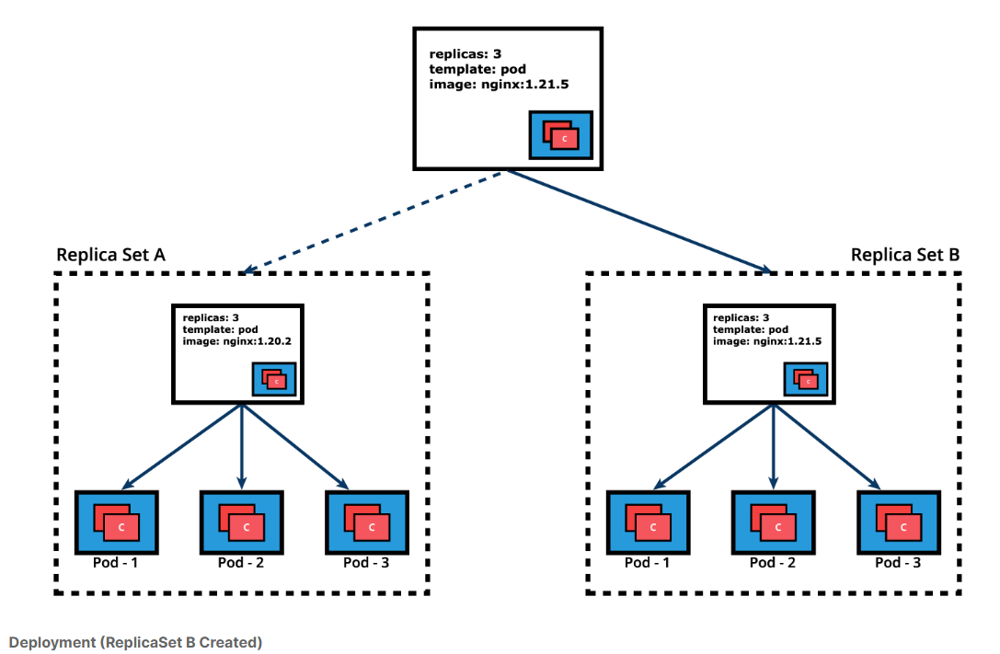

# Deployments

Deployment objects provide declarative updates to Pods and ReplicaSets. The DeploymentController is part of the control plane node's controller manager, and as a controller it also ensures that the current state always matches the desired state of our running containerized application. It allows for seamless application updates and rollbacks, known as the default RollingUpdate strategy, through rollouts and rollbacks, and it directly manages its ReplicaSets for application scaling. It also supports a disruptive, less popular update strategy, known as Recreate.

Below is an example of a Deployment object's definition manifest in YAML format. This represents the declarative method to define an object, and can serve as a template for a much more complex Deployment definition manifest if desired:

```yaml

apiVersion: apps/v1
kind: Deployment
metadata:
  name: nginx-deployment
  labels:
    app: nginx-deployment
spec:
  replicas: 3
  selector:
    matchLabels:
      app: nginx-deployment
  template:
    metadata:
      labels:
        app: nginx-deployment
    spec:
      containers:
      - name: nginx
        image: nginx:1.20.2
        ports:
        - containerPort: 80

```

    $ kubectl create -f def-deploy.yaml

Creating a deploy directily from command line

    $ kubectl create deployment nginx-deployment \
    --image=nginx:1.20.2 --port=80 --replicas=3

Generate a deploy template YAML

    $ kubectl create deployment nginx-deployment --image=nginx:1.20.2 \
    --port=80 --replicas=3 --dry-run=client -o yaml > nginx-deploy.yaml

### Rolling update && rollback 



Basic mandatory commands

    $ kubectl apply -f nginx-deploy.yaml --record
    $ kubectl get deployments
    $ kubectl get deploy -o wide
    $ kubectl scale deploy nginx-deployment --replicas=4
    $ kubectl get deploy nginx-deployment -o yaml
    $ kubectl get deploy nginx-deployment -o json
    $ kubectl describe deploy nginx-deployment
    $ kubectl rollout status deploy nginx-deployment
    $ kubectl rollout history deploy nginx-deployment
    $ kubectl rollout history deploy nginx-deployment --revision=1
    $ kubectl set image deploy nginx-deployment nginx=nginx:1.21.5 --record
    $ kubectl rollout history deploy nginx-deployment --revision=2
    $ kubectl rollout undo deploy nginx-deployment --to-revision=1
    $ kubectl get all -l app=nginx -o wide
    $ kubectl delete deploy nginx-deployment
    $ kubectl get deploy,rs,po -l app=nginx

