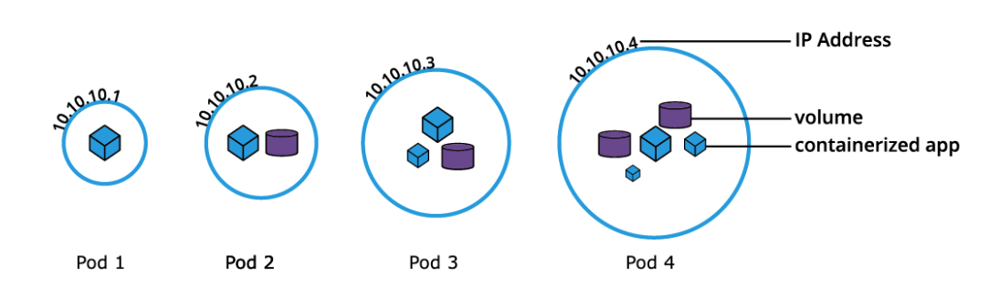

# Pods



```yaml
apiVersion: v1
kind: Pod
metadata:
  name: nginx-pod
  labels:
    run: nginx-pod
spec:
  containers:
  - name: nginx-pod
    image: nginx:1.22.1
    ports:
    - containerPort: 80

```

Creating a container based on a file

    $ kubectl create -f def-pod.yaml

Imperatively, we can simply run the Pod defined above without the definition manifest as such:

    $ kubectl run nginx-pod --image=nginx:1.22.1 --port=80

Creating a file from native templates

    $ kubectl run nginx-pod --image=nginx:1.22.1 --port=80 \
    --dry-run=client -o yaml > nginx-pod.yaml

    $ kubectl create -f nginx-pod.yaml

some good commands to have handy

    $ kubectl apply -f nginx-pod.yaml
    $ kubectl get pods
    $ kubectl get pod nginx-pod -o yaml
    $ kubectl get pod nginx-pod -o json
    $ kubectl describe pod nginx-pod
    $ kubectl delete pod nginx-pod
