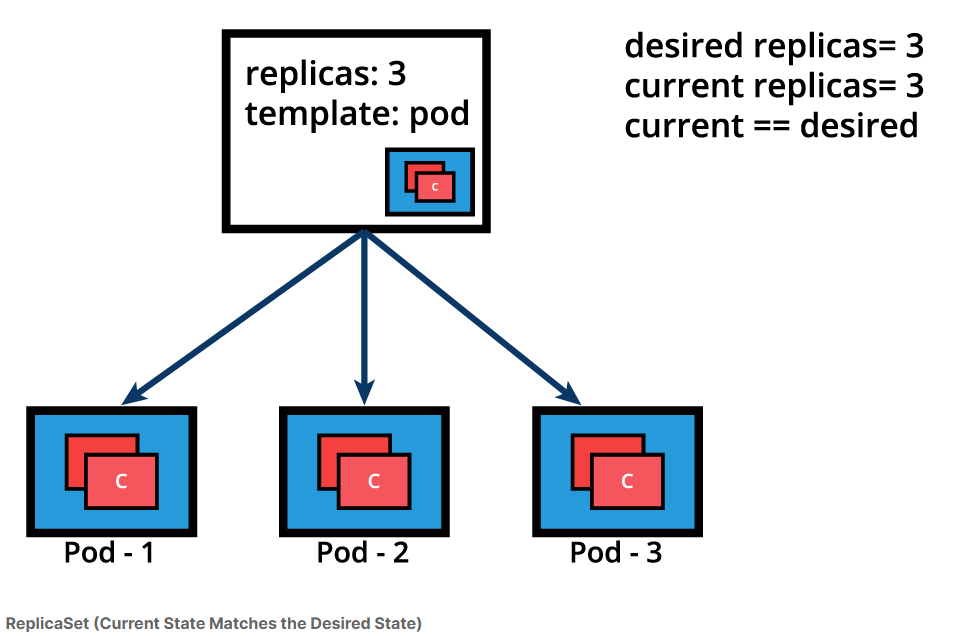

# ReplicaSets 



Below is an example of a ReplicaSet object's definition manifest in YAML format. This represents the declarative method to define an object, and can serve as a template for a much more complex ReplicaSet definition manifest if desired:

```
apiVersion: apps/v1
kind: ReplicaSet
metadata:
  name: frontend
  labels:
    app: guestbook
    tier: frontend
spec:
  replicas: 3
  selector:
    matchLabels:
      app: guestbook
  template:
    metadata:
      labels:
        app: guestbook
    spec:
      containers:
      - name: php-redis
        image: gcr.io/google_samples/gb-frontend:v3

```

The above definition manifest, if stored by a redis-rs.yaml file, is loaded into the cluster to run a set of three identical Pod replicas and their associated container image. While create is exemplified below, advanced Kubernetes practitioners may opt to use apply instead:

    $ kubectl create -f redis-rs.yaml

Before advancing to more complex application deployment and management methods, become familiar with ReplicaSet operations with additional commands such as:

    $ kubectl apply -f redis-rs.yaml
    $ kubectl get replicasets
    $ kubectl get rs
    $ kubectl scale rs frontend --replicas=4
    $ kubectl get rs frontend -o yaml
    $ kubectl get rs frontend -o json
    $ kubectl describe rs frontend
    $ kubectl delete rs frontend