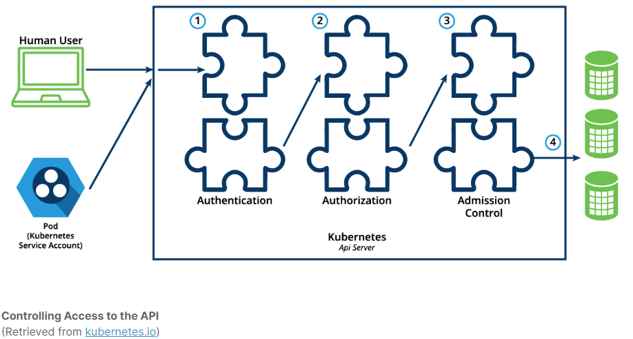

# Authentication, Authorization, and Admission Control - Overview

To access and manage Kubernetes resources or objects in the cluster, we need to access a specific API endpoint on the API server. Each access request goes through the following access control stages:

- ### Authentication
    Authenticate a user based on credentials provided as part of API requests.
- ### Authorization
    Authorizes the API requests submitted by the authenticated user.
- ### Admission Control
    Software modules that validate and/or modify user requests.



### Kubernetes supports two kinds of users:

- #### Normal Users
  They are managed outside of the Kubernetes cluster via independent services like User/Client Certificates, a file listing usernames/passwords, Google accounts, etc.
- #### Service Accounts
    Service Accounts allow in-cluster processes to communicate with the API server to perform various operations. Most of the Service Accounts are created automatically via the API server, but they can also be created manually. The Service Accounts are tied to a particular Namespace and mount the respective credentials to communicate with the API server as Secrets.


### For authentication, Kubernetes uses a series of authentication modules:

- #### X509 Client Certificates
    To enable client certificate authentication, we need to reference a file containing one or more certificate authorities by passing the --client-ca-file=SOMEFILE option to the API server. The certificate authorities mentioned in the file would validate the client certificates presented by users to the API server. A demonstration video covering this topic can be found at the end of this chapter.
- #### Static Token File
    We can pass a file containing pre-defined bearer tokens with the --token-auth-file=SOMEFILE option to the API server. Currently, these tokens would last indefinitely, and they cannot be changed without restarting the API server.
- #### Bootstrap Tokens
    Tokens used for bootstrapping new Kubernetes clusters.
- #### Service Account Tokens
    Automatically enabled authenticators that use signed bearer tokens to verify requests. These tokens get attached to Pods using the Service Account Admission Controller, which allows in-cluster processes to talk to the API server.
- #### OpenID Connect Tokens
    OpenID Connect helps us connect with OAuth2 providers, such as Microsoft Entra ID (previously known as Azure Active Directory), Salesforce, and Google, to offload the authentication to external services.
- #### Webhook Token Authentication
    With Webhook-based authentication, verification of bearer tokens can be offloaded to a remote service.
- #### Authenticating Proxy
    Allows for the programming of additional authentication logic.


### Authorization Modes
- #### Close Node
    Node authorization is a special-purpose authorization mode which specifically authorizes API requests made by kubelets. It authorizes the kubelet's read operations for services, endpoints, or nodes, and writes operations for nodes, pods, and events. For more details, please review the Node authorization documentation.

- #### Close Attribute-Based Access Control (ABAC)
    With the ABAC authorizer, Kubernetes grants access to API requests, which combine policies with attributes. In the following example, user bob can only read Pods in the Namespace lfs158.

        {
        "apiVersion": "abac.authorization.kubernetes.io/v1beta1",
        "kind": "Policy",
        "spec": {
            "user": "bob",
            "namespace": "lfs158",
            "resource": "pods",
            "readonly": true
        }
        }

    To enable ABAC mode, we start the API server with the --authorization-mode=ABAC option, while specifying the authorization policy with --authorization-policy-file=PolicyFile.json. For more details, please review the ABAC authorization documentation.

- #### Close Webhook
    In Webhook mode, Kubernetes can request authorization decisions to be made by third-party services, which would return true for successful authorization, and false for failure. In order to enable the Webhook authorizer, we need to start the API server with the --authorization-webhook-config-file=SOME_FILENAME option, where SOME_FILENAME is the configuration of the remote authorization service. For more details, please see the Webhook mode documentation.


- #### Role-Based Access Control (RBAC)
    In general, with RBAC we regulate the access to resources based on the Roles of individual users. In Kubernetes, multiple Roles can be attached to subjects like users, service accounts, etc. While creating the Roles, we restrict resource access by specific operations, such as create, get, update, patch, etc. These operations are referred to as verbs. In RBAC, we can create two kinds of Roles:

    - **Role**  
    A Role grants access to resources within a specific Namespace.

    - **ClusterRole**  
    A ClusterRole grants the same permissions as Role does, but its scope is cluster-wide.  

```yaml
apiVersion: rbac.authorization.k8s.io/v1
kind: Role
metadata:
  namespace: lfs158
  name: pod-reader
rules:
- apiGroups: [""] # "" indicates the core API group
  resources: ["pods"]
  verbs: ["get", "watch", "list"]
```