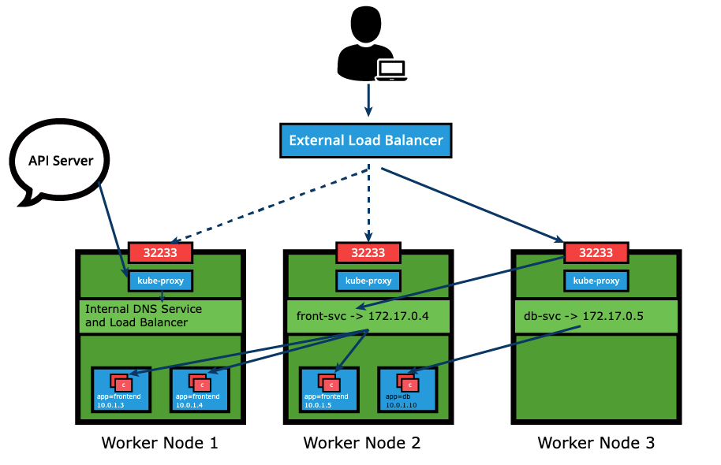

# Services

In this chapter, we will learn about Service objects used to abstract the communication between cluster internal microservices, or with the external world. A Service offers a single DNS entry for a stateless containerized application managed by the Kubernetes cluster, regardless of the number of its replicas, by providing a common load balancing access point to a set of pods logically grouped and managed by a controller such as a Deployment, ReplicaSet, or DaemonSet. 

```yaml
apiVersion: v1
kind: Service
metadata:
  name: frontend-svc
spec:
  selector:
    app: frontend
  ports:
  - protocol: TCP
    port: 80
    targetPort: 5000
```
cria servico pelo yaml

    $ kubectl apply -f frontend-svc.yaml

cria diretamente na linha de comando imperativamente

    $ kubectl expose deploy frontend --name=frontend-svc --port=80 --target-port=5000

Cria o servico primeiro com o comando "create service" e depois da  apply  

    $ kubectl create service clusterip frontend --tcp=80:5000--dry-run=client -o yaml | sed 's/name: frontend/name: frontend-svc/g' | kubectl apply -f -


The Service and associated endpoints can be listed with:

    $ kubectl get service,endpoints frontend-svc
    $ kubectl get svc,ep frontend-svc

### kube-proxy
Each cluster node runs a daemon called kube-proxy, a node agent that watches the API server on the control plane node for the addition, updates, and removal of Services and endpoints. kube-proxy is responsible for implementing the Service configuration on behalf of an administrator or developer, in order to enable traffic routing to an exposed application running in Pods.

 In the example below, for each new Service, on each node, kube-proxy configures iptables rules to capture the traffic for its ClusterIP and forwards it to one of the Service's endpoints. Therefore any node can receive the external traffic and then route it internally in the cluster based on the iptables rules. When the Service is removed, kube-proxy removes the corresponding iptables rules on all nodes as well.

 


### Traffic Policies
The kube-proxy node agent together with the iptables implement the load-balancing mechanism of the Service when traffic is being routed to the application Endpoints. Due to restricting characteristics of the iptables this load-balancing is random by default. This means that the Endpoint Pod to receive the request forwarded by the Service will be randomly selected out of many replicas. This mechanism does not guarantee that the selected receiving Pod is the closest or even on the same node as the requester, therefore not the most efficient mechanism. Since this is the iptables supported load-balancing mechanism, if we desire better outcomes, we would need to take advantage of traffic policies.
```yaml
apiVersion: v1
kind: Service
metadata:
  name: frontend-svc
spec:
  selector:
    app: frontend
  ports:
    - protocol: TCP
      port: 80
      targetPort: 5000
  internalTrafficPolicy: Local
  externalTrafficPolicy: Local
  ```

### Service Discovery
As Services are the primary mode of communication between containerized applications managed by Kubernetes, it is helpful to be able to discover them at runtime. Kubernetes supports two methods for discovering Services.


- **Close Environment variables**  

    As soon as the Pod starts on any worker node, the kubelet daemon running on that node adds a set of environment variables in the Pod for all active Services. For example, if we have an active Service called redis-master, which exposes port 6379, and its ClusterIP is 172.17.0.6, then, on a newly created Pod, we can see the following environment variables:

        REDIS_MASTER_SERVICE_HOST=172.17.0.6
        REDIS_MASTER_SERVICE_PORT=6379
        REDIS_MASTER_PORT=tcp://172.17.0.6:6379
        REDIS_MASTER_PORT_6379_TCP=tcp://172.17.0.6:6379
        REDIS_MASTER_PORT_6379_TCP_PROTO=tcp
        REDIS_MASTER_PORT_6379_TCP_PORT=6379
        REDIS_MASTER_PORT_6379_TCP_ADDR=172.17.0.6

    With this solution, we need to be careful while ordering our Services, as the Pods will not have the environment variables set for Services which are created after the Pods are created.

- **Close DNS**  

    Kubernetes has an add-on for DNS, which creates a DNS record for each Service and its format is my-svc.my-namespace.svc.cluster.local. Services within the same Namespace find other Services just by their names. If we add a Service redis-master in ;my-ns Namespace, all Pods in the same my-ns Namespace lookup the Service just by its name, redis-master. Pods from other Namespaces, such as test-ns, lookup the same Service by adding the respective Namespace as a suffix, such as redis-master.my-ns or providing the FQDN of the service as redis-master.my-ns.svc.cluster.local.

    This is the most common and highly recommended solution. For example, in the previous section's image, we have seen that an internal DNS is configured, which maps our Services **frontend-svc** and **db-svc** to **172.17.0.4** and **172.17.0.5** IP addresses respectively.


### ServiceType: ClusterIP and NodePort
- **ClusterIP**  
    is the default ServiceType. A Service receives a Virtual IP address, known as its ClusterIP. This Virtual IP address is used for communicating with the Service and is accessible only from within the cluster. The frontend-svc Service definition manifest now includes an explicit type for ClusterIP. If omitted, the default ClusterIP service type is set up:  

    ```yaml
    apiVersion: v1
        kind: Service
        metadata:
        name: frontend-svc
        spec:
        selector:
            app: frontend
        ports:
        - protocol: TCP
            port: 80
            targetPort: 5000
        type: ClusterIP
    ```

- **NodePort**

    The NodePort ServiceType is useful when we want to make our Services accessible from the external world. The end-user connects to any worker node on the specified high-port, which proxies the request internally to the ClusterIP of the Service, then the request is forwarded to the applications running inside the cluster. Let's not forget that the Service is load balancing such requests, and only forwards the request to one of the Pods running the desired application. To manage access to multiple application Services from the external world, administrators can configure a reverse proxy - an ingress, and define rules that target specific Services within the cluster.

    The NodePort type has to be explicitly declared in the Service definition manifest or with the imperative methods explored in an earlier lesson - the expose and create service commands. Declaring the nodePort value 32233 is optional, ensuring there is no conflict. We are reusing the earlier definition and commands updated for the NodePort type and declaring the nodePort value where supporte
    ``` yaml
    apiVersion: v1
    kind: Service
    metadata:
      name: frontend-svc
    spec:
      selector:
        app: frontend
      ports:
      - protocol: TCP
        port: 80
        targetPort: 5000
        nodePort: 32233
    type: NodePort
    ```
            
        $ kubectl expose deploy frontend --name=frontend-svc --port=80 --target-port=5000 --type=NodePort 

        $ kubectl create service nodeport frontend-svc --tcp=80:5000 --node-port=32233


### LoadBalancer

The LoadBalancer ServiceType will only work if the underlying infrastructure supports the automatic creation of Load Balancers and have the respective support in Kubernetes, as is the case with the Google Cloud Platform and AWS. If no such feature is configured, the LoadBalancer IP address field is not populated, it remains in Pending state, but the Service will still work as a typical NodePort type Service.



### ServiceType: ExternalIP

A Service can be mapped to an ExternalIP address if it can route to one or more of the worker nodes. Traffic that is ingressed into the cluster with the ExternalIP (as destination IP) on the Service port, gets routed to one of the Service endpoints. This type of service requires an external cloud provider such as Google Cloud Platform or AWS and a Load Balancer configured on the cloud provider's infrastructure.


### Multi-Port Services

A Service resource can expose multiple ports at the same time if required. Its configuration is flexible enough to allow for multiple groupings of ports to be defined in the manifest. This is a helpful feature when exposing Pods with one container listening on more than one port, or when exposing Pods with multiple containers listening on one or more ports.

```yaml
apiVersion: v1
kind: Service
metadata:
  name: my-service
spec:
  selector:
    app: myapp
  type: NodePort
  ports:
  - name: http
    protocol: TCP
    port: 8080
    targetPort: 80
    nodePort: 31080
  - name: https
    protocol: TCP
    port: 8443
    targetPort: 443
    nodePort: 31443
```

### Port Forwarding
Another application exposure mechanism in Kubernetes is port forwarding. In Kubernetes the port forwarding feature allows users to easily forward a local port to an application port. Thanks to its flexibility, the application port can be a Pod container port, a Service port, and even a Deployment container port (from its Pod template). This allows users to test and debug their application running in a remote cluster by targeting a port on their local workstation (either http://localhost:port or http://127.0.0.1:port), a solution for remote cloud clusters or virtualized on premises clusters.

Based on the earlier explored frontend Deployment and frontend-svc Service, port forwarding can be easily achieved via one of the following methods:

    $ kubectl port-forward deploy/frontend 8080:5000 

    $ kubectl port-forward frontend-77cbdf6f79-qsdts 8080:5000 

    $ kubectl port-forward svc/frontend-svc 8080:80