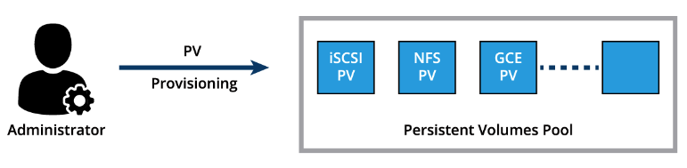

# KUBERNETES VOLUME MANAGEMENT

### Container Storage Interface (CSI)

Storage vendors and community members from different orchestrators started working together to standardize the Volume interface - a volume plugin built using a standardized Container Storage Interface (CSI) designed to work on different container orchestrators with a variety of storage providers.

### Volume Types

### PersistentVolumes

A Persistent Volume is a storage abstraction backed by several storage technologies, which could be local to the host where the Pod is deployed with its application container(s), network attached storage, cloud storage, or a distributed storage solution. A Persistent Volume is statically provisioned by the cluster administrator.

