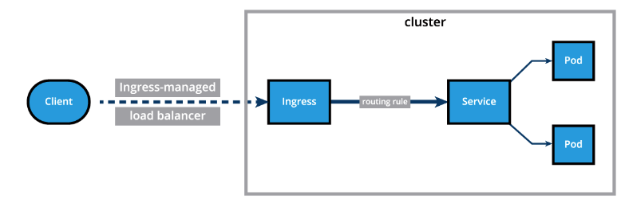
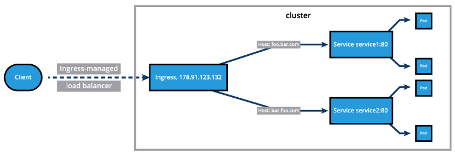

# Ingress

In this chapter, we will explore the Ingress API resource, which represents another layer of abstraction, deployed in front of the Service API resources, offering a unified method of managing access to our applications from the external world.

With Services, routing rules are associated with a given Service. They exist for as long as the Service exists, and there are many rules because there are many Services in the cluster. If we can somehow decouple the routing rules from the application and centralize the rules management, we can then update our application without worrying about its external access. This can be done using the Ingress resource - a collection of rules that manage inbound connections to cluster Services.

To allow the inbound connection to reach the cluster Services, Ingress configures a Layer 7 HTTP/HTTPS load balancer for Services and provides the following:

- TLS (Transport Layer Security)
- Name-based virtual hosting
- Fanout routing
- Loadbalancing
- Custom rules



With Ingress, users do not connect directly to a Service. Users reach the Ingress endpoint, and, from there, the request is forwarded to the desired Service. You can see an example of a Name-Based Virtual Hosting Ingress definition below:
```yaml
apiVersion: networking.k8s.io/v1 
kind: Ingress
metadata:
  annotations:
    nginx.ingress.kubernetes.io/service-upstream: "true"
  name: virtual-host-ingress
  namespace: default
spec:
  ingressClassName: nginx
  rules:
  - host: blue.example.com
    http:
      paths:
      - backend:
          service:
            name: webserver-blue-svc
            port:
              number: 80
        path: /
        pathType: ImplementationSpecific
  - host: green.example.com
    http:
      paths:
      - backend:
          service:
            name: webserver-green-svc
            port:
              number: 80
        path: /
        pathType: ImplementationSpecific
```
In the example above, user requests to both blue.example.com and green.example.com would go to the same Ingress endpoint, and, from there, they would be forwarded to webserver-blue-svc, and webserver-green-svc, respectively.

### Name-Based Virtual Hosting Ingress



```yaml
apiVersion: networking.k8s.io/v1
kind: Ingress
metadata:
  annotations:
    nginx.ingress.kubernetes.io/service-upstream: "true"
  name: fan-out-ingress
  namespace: default
spec:
  ingressClassName: nginx 
  rules:
  - host: example.com
    http:
      paths:
      - path: /blue
        backend:
          service:
            name: webserver-blue-svc
            port:
              number: 80
        pathType: ImplementationSpecific
      - path: /green
        backend:
          service:
            name: webserver-green-svc
            port:
              number: 80
        pathType: ImplementationSpecific
```


The Ingress resource does not do any request forwarding by itself, it merely accepts the definitions of traffic routing rules. The ingress is fulfilled by an Ingress Controller, which is a reverse proxy responsible for traffic routing based on rules defined in the Ingress resource.

## Ingress Controller

An Ingress Controller is an application watching the Control Plane Node's API server for changes in the Ingress resources and updates the Layer 7 Load Balancer accordingly. An Ingress Controller is also known as Controllers, Ingress Proxy, Service Proxy, Reverse Proxy, etc. Kubernetes supports an array of Ingress Controllers, and, if needed, we can also build our own. GCE L7 Load Balancer Controller, AWS Load Balancer Controller, and Nginx Ingress Controller are commonly used Ingress Controllers. Other controllers are Contour, HAProxy Ingress, Istio Ingress, Kong, Traefik, etc. In order to ensure that the ingress controller is watching its corresponding ingress resource, the ingress resource definition manifest needs to include an ingress class name, such as spec.ingressClassName: nginx and optionally one or several annotations specific to the desired controller, such as nginx.ingress.kubernetes.io/service-upstream: "true" (for an nginx ingress controller).

Starting the Ingress Controller in Minikube is extremely simple. Minikube ships with the Nginx Ingress Controller set up as an add-on, disabled by default. It can be easily enabled by running the following command:

$ minikube addons enable ingress 